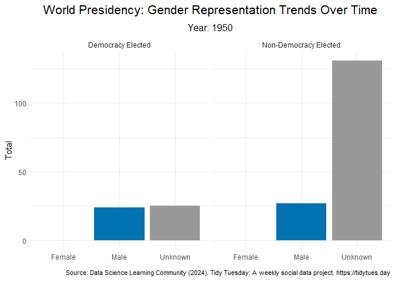

Tidy Tuesday : Democracy Data
================
Retno K. Ningrum
2024-11-03

## Load all Libraries

``` r
library(dplyr)
library(ggplot2)
library(gganimate)
library(extrafont)
```

## Read and View Data

``` r
df <- readr::read_csv('https://raw.githubusercontent.com/rfordatascience/tidytuesday/master/data/2024/2024-11-05/democracy_data.csv')

View(df)    #view all the data
glimpse(df) #check dataset type
```

    ## Rows: 14,768
    ## Columns: 43
    ## $ country_name                <chr> "Afghanistan", "Afghanistan", "Afghanistan…
    ## $ country_code                <chr> "AFG", "AFG", "AFG", "AFG", "AFG", "AFG", …
    ## $ year                        <dbl> 1950, 1951, 1952, 1953, 1954, 1955, 1956, …
    ## $ regime_category_index       <dbl> 5, 5, 5, 5, 5, 5, 5, 5, 5, 5, 5, 5, 5, 5, …
    ## $ regime_category             <chr> "Royal dictatorship", "Royal dictatorship"…
    ## $ is_monarchy                 <lgl> TRUE, TRUE, TRUE, TRUE, TRUE, TRUE, TRUE, …
    ## $ is_commonwealth             <lgl> FALSE, FALSE, FALSE, FALSE, FALSE, FALSE, …
    ## $ monarch_name                <chr> "Mohammed Zahir Shah", "Mohammed Zahir Sha…
    ## $ monarch_accession_year      <dbl> 1933, 1933, 1933, 1933, 1933, 1933, 1933, …
    ## $ monarch_birthyear           <dbl> 1914, 1914, 1914, 1914, 1914, 1914, 1914, …
    ## $ is_female_monarch           <lgl> FALSE, FALSE, FALSE, FALSE, FALSE, FALSE, …
    ## $ is_democracy                <lgl> FALSE, FALSE, FALSE, FALSE, FALSE, FALSE, …
    ## $ is_presidential             <lgl> FALSE, FALSE, FALSE, FALSE, FALSE, FALSE, …
    ## $ president_name              <chr> NA, NA, NA, NA, NA, NA, NA, NA, NA, NA, NA…
    ## $ president_accesion_year     <dbl> NA, NA, NA, NA, NA, NA, NA, NA, NA, NA, NA…
    ## $ president_birthyear         <dbl> NA, NA, NA, NA, NA, NA, NA, NA, NA, NA, NA…
    ## $ is_interim_phase            <lgl> NA, NA, NA, NA, NA, NA, NA, NA, NA, NA, NA…
    ## $ is_female_president         <lgl> NA, NA, NA, NA, NA, NA, NA, NA, NA, NA, NA…
    ## $ is_colony                   <lgl> FALSE, FALSE, FALSE, FALSE, FALSE, FALSE, …
    ## $ colony_of                   <chr> NA, NA, NA, NA, NA, NA, NA, NA, NA, NA, NA…
    ## $ colony_administrated_by     <chr> NA, NA, NA, NA, NA, NA, NA, NA, NA, NA, NA…
    ## $ is_communist                <lgl> FALSE, FALSE, FALSE, FALSE, FALSE, FALSE, …
    ## $ has_regime_change_lag       <lgl> FALSE, FALSE, FALSE, FALSE, FALSE, FALSE, …
    ## $ spatial_democracy           <dbl> 0.00, 0.00, 0.25, 0.25, 0.25, 0.25, 0.25, …
    ## $ parliament_chambers         <dbl> 2, 2, 2, 2, 2, 2, 2, 2, 2, 2, 2, 2, 2, 2, …
    ## $ has_proportional_voting     <lgl> FALSE, FALSE, FALSE, FALSE, NA, NA, NA, NA…
    ## $ election_system             <chr> NA, NA, NA, NA, NA, NA, NA, NA, NA, NA, NA…
    ## $ lower_house_members         <dbl> 171, 171, 171, 171, NA, NA, NA, NA, NA, NA…
    ## $ upper_house_members         <dbl> NA, NA, NA, NA, NA, NA, NA, NA, NA, NA, NA…
    ## $ third_house_members         <dbl> NA, NA, NA, NA, NA, NA, NA, NA, NA, NA, NA…
    ## $ has_new_constitution        <lgl> FALSE, FALSE, FALSE, FALSE, FALSE, FALSE, …
    ## $ has_full_suffrage           <lgl> FALSE, FALSE, FALSE, FALSE, FALSE, FALSE, …
    ## $ suffrage_restriction        <chr> "Male vote only", "Male vote only", "Male …
    ## $ electoral_category_index    <dbl> 2, 2, 2, 2, 2, 2, 2, 2, 2, 2, 2, 2, 2, 2, …
    ## $ electoral_category          <chr> "non-democratic multi-party elections", "n…
    ## $ spatial_electoral           <dbl> 1.50, 1.50, 1.75, 1.75, 1.75, 1.75, 1.75, …
    ## $ has_alternation             <lgl> FALSE, FALSE, FALSE, FALSE, FALSE, FALSE, …
    ## $ is_multiparty               <lgl> TRUE, TRUE, TRUE, TRUE, TRUE, TRUE, TRUE, …
    ## $ has_free_and_fair_election  <lgl> FALSE, FALSE, FALSE, FALSE, FALSE, FALSE, …
    ## $ parliamentary_election_year <dbl> 0, 0, 1, 0, 0, 1, 0, 0, 1, 0, 0, 1, 0, 0, …
    ## $ election_month              <chr> NA, NA, "February", NA, NA, NA, NA, NA, NA…
    ## $ election_year               <dbl> NA, NA, 1952, NA, NA, NA, NA, NA, NA, NA, …
    ## $ has_postponed_election      <lgl> FALSE, FALSE, FALSE, FALSE, FALSE, FALSE, …

``` r
#I am interested to several variables, so I want to check the category of each variable of interest with unique() function. 
unique(df$electoral_category) 
```

    ## [1] "non-democratic multi-party elections"
    ## [2] "no elections"                        
    ## [3] "single-party elections"              
    ## [4] "democratic elections"                
    ## [5] NA

``` r
unique(df$election_year)
```

    ##  [1]   NA 1952 1965 1969 1988 2005 2010 2018 1950 1954 1958 1962 1966 1970 1974
    ## [16] 1978 1982 1987 1991 1992 1996 1997 2001 2009 2013 2017 1951 1964 1977 2002
    ## [31] 2007 2012 1973 1980 1986 2008 1981 1984 1989 1994 1999 2000 2015 2020 1956
    ## [46] 1960 1971 1976 2004 2014 1963 1983 1995 2003 2019 1993 1949 1955 1961 1972
    ## [61] 1975 1990 1998 2016 1953 1959 1979 2006 1967 1968 1985 1957 2011 1865

``` r
unique(df$is_democracy)
```

    ## [1] FALSE  TRUE    NA

## Data Cleaning and Manipulation

After looking the data and find my interest, I am deciding to create a
plot that showing the gender representation trends in the world
presidency overtime. Also comparing the trend between democracy elected
versus non-democracy elected. Therefore, several data cleaning and
manipulation should be done :  
1. select only the variable of interest  
2. rename the category of each variable: gender and democracy

``` r
#Data Cleaning and Manipulation
df_gender <- df %>%                                               #create dataset by using "df" data
  select(country_name, is_female_president, year, is_democracy) %>% #select these variables
  group_by(year, is_female_president, is_democracy) %>%           #group by these variables
  summarise(total = n()) %>%                  #create new variables "total" and summarize data found
  ungroup() %>%                               #always do this after grouping
   mutate(is_female_president = case_when(    #rename the category in the "is_female_president"
    is_female_president == FALSE ~ "Male",    #where FALSE into Male
    is_female_president == TRUE ~ "Female",   #where TRUE into Female
    is.na(is_female_president) ~ "Unknown"    #where NA into Unknown
  )) %>%
    mutate(is_female_president = factor(    
      is_female_president,                          #factorize the category as I want to use levels
      levels = c("Female", "Male", "Unknown"))) %>% #level the category, as I want female come first
    mutate( is_democracy = case_when(                #rename the category in is_democracy
    is_democracy == FALSE ~ "Non-Democracy Elected", #where FALSE into non-democracy elected
    is_democracy == TRUE ~ "Democracy Elected")) %>% #where TRUE into democracy elected
  filter(!is.na(is_democracy))                #delete NA in is_democracy
```

## Creating Plot

Once I clean the data, its time for me to create the plot. My plan is to
make a moving plot, where the transition is based on year.

``` r
ggplot(df_gender,                         #use ggplot from df_gender dataset
       aes(x = is_female_president,       #assign x axis with is_female_president
           y = total,                     #assigyn y axis with total
           fill = is_female_president)) + #assign the fil is_female_president, dealing with color 
  geom_bar(stat='identity') +    #add geom bar
  facet_wrap(~ is_democracy) +   #facet wrap by is_democracy
  scale_fill_manual( values =                      #Assign colors in fill
                       c("Male" = "#0072B2",       #male is blue
                         "Female" = "#CC79A7",     #female is pink
                         "Unknown" = "#999999")) + #unknown is grey
    labs(x = "",y = "Total",                                           #add label in y axis
    title = "World Presidency: Gender Representation Trends Over Time",#add title
    subtitle = "Year: {round(frame_time)}",                      #add subtitle, and round the year
    caption = "source: Bjørnskov, C., & Rode, M. (2020)") +      #add caption of source
  theme_minimal() +                                                   #use this theme type
  theme(
    plot.title = element_text(size = 16, face = "bold", hjust = 0.5), #setting the size, location of title
    plot.subtitle = element_text(size = 12, hjust = 0.5),  #setting the size, location of subtitle
    plot.caption = element_text(size = 12, hjust = 1),   #setting the size, location of caption
    legend.position = "none") +                 #do not add any legend, as color in bar is obvious
  transition_time(year) +   #add transition by year
  ease_aes('sine-in-out')   #choose this type of animation of transition
```


