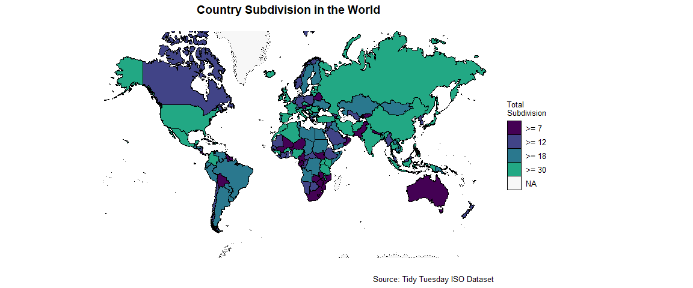

Tidy Tuesday : ISO
================
Retno K. Ningrum
2024-11-11

## Load all Libraries

``` r
library(countries)
library(dplyr)
library(ggplot2)
```

## Read Data and Check Data

``` r
#Read the data
countries <- readr::read_csv('https://raw.githubusercontent.com/rfordatascience/tidytuesday/master/data/2024/2024-11-12/countries.csv')
country_subdivisions <- readr::read_csv('https://raw.githubusercontent.com/rfordatascience/tidytuesday/master/data/2024/2024-11-12/country_subdivisions.csv')
former_countries <- readr::read_csv('https://raw.githubusercontent.com/rfordatascience/tidytuesday/master/data/2024/2024-11-12/former_countries.csv')


#Check the data
glimpse(countries)
```

    ## Rows: 249
    ## Columns: 6
    ## $ alpha_2       <chr> "AW", "AF", "AO", "AI", "AX", "AL", "AD", "AE", "AR", "A…
    ## $ alpha_3       <chr> "ABW", "AFG", "AGO", "AIA", "ALA", "ALB", "AND", "ARE", …
    ## $ numeric       <dbl> 533, 4, 24, 660, 248, 8, 20, 784, 32, 51, 16, 10, 260, 2…
    ## $ name          <chr> "Aruba", "Afghanistan", "Angola", "Anguilla", "Åland Isl…
    ## $ official_name <chr> NA, "Islamic Republic of Afghanistan", "Republic of Ango…
    ## $ common_name   <chr> NA, NA, NA, NA, NA, NA, NA, NA, NA, NA, NA, NA, NA, NA, …

``` r
glimpse(country_subdivisions)
```

    ## Rows: 5,046
    ## Columns: 5
    ## $ code    <chr> "AD-02", "AD-03", "AD-04", "AD-05", "AD-06", "AD-07", "AD-08",…
    ## $ name    <chr> "Canillo", "Encamp", "La Massana", "Ordino", "Sant Julià de Lò…
    ## $ type    <chr> "Parish", "Parish", "Parish", "Parish", "Parish", "Parish", "P…
    ## $ parent  <chr> NA, NA, NA, NA, NA, NA, NA, NA, NA, NA, NA, NA, NA, NA, NA, NA…
    ## $ alpha_2 <chr> "AD", "AD", "AD", "AD", "AD", "AD", "AD", "AE", "AE", "AE", "A…

``` r
glimpse(former_countries)
```

    ## Rows: 31
    ## Columns: 6
    ## $ alpha_4        <chr> "AIDJ", "ANHH", "BQAQ", "BUMM", "BYAA", "CSHH", "CSXX",…
    ## $ alpha_3        <chr> "AFI", "ANT", "ATB", "BUR", "BYS", "CSK", "SCG", "CTE",…
    ## $ numeric        <dbl> 262, 530, NA, 104, 112, 200, 891, 128, 278, 204, NA, 24…
    ## $ name           <chr> "French Afars and Issas", "Netherlands Antilles", "Brit…
    ## $ date_withdrawn <chr> "1977", "2010-12-15", "1979", "1989-12-05", "1992-06-15…
    ## $ comment        <chr> NA, "had numeric code 532 until Aruba split away in 198…

## Data Manipulation

After check the data, I decide to just use the Countries and
Country_subdivision data to visualize the total subdivision of each
country in the world.

``` r
# Join countries and country_subdivisions
all_countries <- full_join(countries,              #join countries and country_subdivision dataset
                           country_subdivisions, 
                           by = "alpha_2") %>%     #using alpha_2 as the reference to join the dataset
  group_by(name.x, alpha_3) %>%                    #group by name.x (name country) and alpha_3
  summarise(total = n())                           #create new column to store the total row found
```

## Create the Map

I will try new package {countries} and use the quick_map() function to
generate the map of total subdivision each country in the world

``` r
# Create the map
quick_map(all_countries,       #create map, using all_countries data
          plot_col = "total",  #use the value in "total" column 
          theme = 9) +         #choose viridis color to fill the map, represent total value
  coord_map("mercator",          #choose the mercator type projection  
            xlim = c(-180, 180), #set the xlim
            ylim = c(-60, 80)) + #set the ylim
  labs(title = "Country Subdivision in the World",   #add title
       caption = "Source: Tidy Tuesday ISO Dataset", #add caption
       fill = "Total                                       
Subdivision") +
  theme(plot.title = element_text(size = 14,                #set the font size of the title
                                  hjust = 0.5,                #set the position of title
                                  face = "bold",            #set title into bold
                                  margin = margin(b = 20)), #set margin between title and map
        plot.caption = element_text(size = 10)) +   #add caption, set size
   theme(legend.position = "right",                #Move legend to the right
         legend.title = element_text(size = 10),    #set the size of legend title
         legend.text = element_text(size = 10))     #set the size of legend text
```



## New things I learned:

1.  quick_map() function. This is the first time I try quick_map to
    create a map. The data needed to create map is only the country’s
    name and the value on each country.  
2.  Margin in theme(). This is the first time I use margin, which allow
    me to set the distance between plot title to the plot/map.
