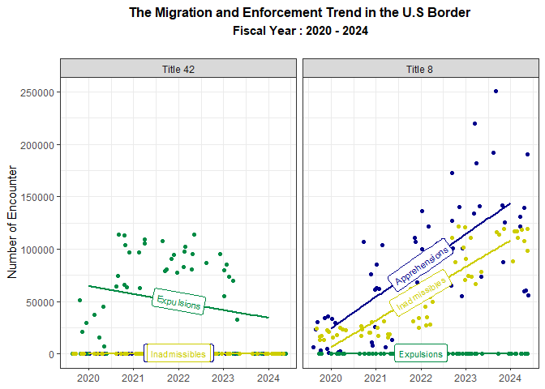
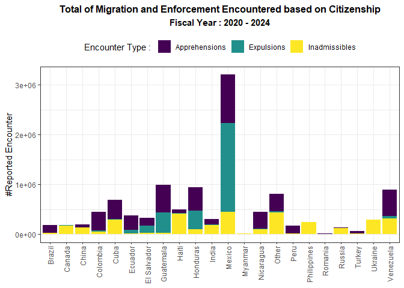
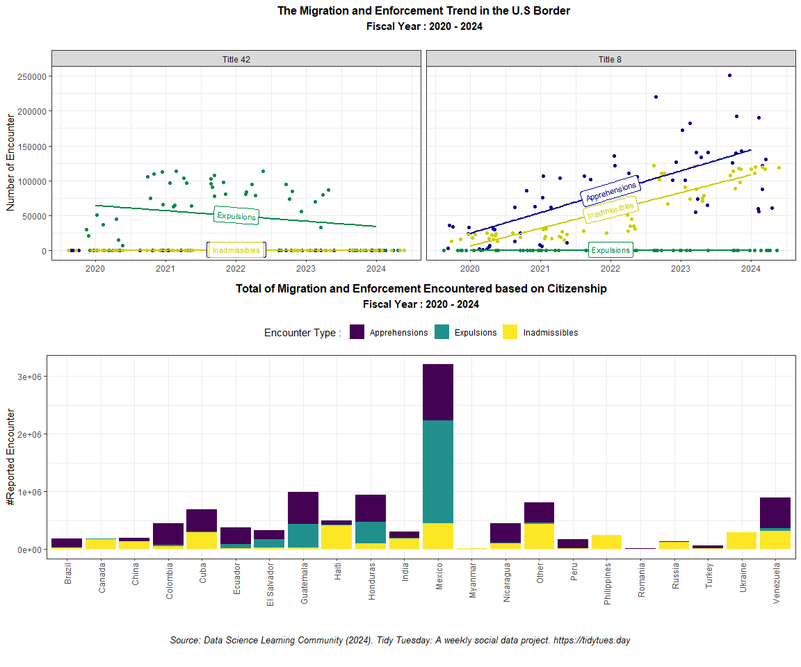

Tidy Tuesday - Custom and Protection
================
Retno K. Ningrum
2024-11-27

#### Load all libraries

``` r
library(tidyverse)    #use ggplot and dplyr package 
library(janitor)      #to clean data
library(gridExtra)    #to combine 2 plot in one frame
library(viridis)      #color choice pallate
library(grid)         #to add annotation
library(geomtextpath) #to add text in the linear model line
library(stringr)      #to change the upper case/lower case
```

#### Read the data

``` r
cbp_resp <- bind_rows(
  read_csv("https://www.cbp.gov/sites/default/files/assets/documents/2023-Nov/nationwide-encounters-fy20-fy23-aor.csv"),
  read_csv("https://www.cbp.gov/sites/default/files/2024-10/nationwide-encounters-fy21-fy24-aor.csv")
) |>
  janitor::clean_names() |>
  unique()
```

#### view data

``` r
glimpse(cbp_resp)                    #check the data
```

    ## Rows: 68,815
    ## Columns: 12
    ## $ fiscal_year            <dbl> 2020, 2020, 2020, 2020, 2020, 2020, 2020, 2020,…
    ## $ month_grouping         <chr> "FYTD", "FYTD", "FYTD", "FYTD", "FYTD", "FYTD",…
    ## $ month_abbv             <chr> "APR", "APR", "APR", "APR", "APR", "APR", "APR"…
    ## $ component              <chr> "Office of Field Operations", "Office of Field …
    ## $ land_border_region     <chr> "Northern Land Border", "Northern Land Border",…
    ## $ area_of_responsibility <chr> "Boston Field Office", "Boston Field Office", "…
    ## $ aor_abbv               <chr> "Boston", "Boston", "Boston", "Boston", "Boston…
    ## $ demographic            <chr> "FMUA", "FMUA", "Single Adults", "Single Adults…
    ## $ citizenship            <chr> "BRAZIL", "CANADA", "CANADA", "CANADA", "CHINA,…
    ## $ title_of_authority     <chr> "Title 8", "Title 8", "Title 42", "Title 8", "T…
    ## $ encounter_type         <chr> "Inadmissibles", "Inadmissibles", "Expulsions",…
    ## $ encounter_count        <dbl> 3, 1, 2, 239, 1, 0, 1, 6, 1, 1, 1, 18, 52, 1, 2…

``` r
unique(cbp_resp$encounter_type)      #check the category in encounter_type
```

    ## [1] "Inadmissibles" "Expulsions"    "Apprehensions"

``` r
unique(cbp_resp$title_of_authority)  #check the category in title_of_authority
```

    ## [1] "Title 8"  "Title 42"

After viewing the data, I decide to create several charts to understand
the trend of expulsion, inadmissibles, and apprehensions over time for
both **title 8** and **title 42** cases. I will also add a graph showing
the total of origin **citizenship** that involved in those 3 reported
custom and border issues.

#### Manipulate the data

``` r
#Create a monthly report
monthly_report <- cbp_resp %>%      #use cbp_resp dataset
  #group data by these column
  group_by(month_abbv, fiscal_year, encounter_type, title_of_authority) %>%
  #create new column  named "total" by summing all the value in encounter_count column
  summarise(total = sum(encounter_count))

glimpse(monthly_report) #review the data
```

    ## Rows: 159
    ## Columns: 5
    ## Groups: month_abbv, fiscal_year, encounter_type [159]
    ## $ month_abbv         <chr> "APR", "APR", "APR", "APR", "APR", "APR", "APR", "A…
    ## $ fiscal_year        <dbl> 2020, 2020, 2020, 2021, 2021, 2021, 2022, 2022, 202…
    ## $ encounter_type     <chr> "Apprehensions", "Expulsions", "Inadmissibles", "Ap…
    ## $ title_of_authority <chr> "Title 8", "Title 42", "Title 8", "Title 8", "Title…
    ## $ total              <dbl> 1203, 15544, 12996, 63044, 112898, 20248, 105649, 1…

``` r
#Now I want to fill the unmentioned month and year with "0" value in total
#step 1. I need to create all possible combinations of the data and named the dataset as "expected_data"
expected_data <- expand.grid(           #create a dataframe from all combination of these vectors
  fiscal_year = 2020:2024 ,             #fiscal_year from 2020 to 2024
  month_abbv = toupper(month.abb),      #month_abbv using abbreviation month with uppercase 
  encounter_type = c("Apprehensions",   #encounter type using these 3 categories
                     "Expulsions", 
                     "Inadmissibles"),
  title_of_authority = c("Title 8",     #title_of_authority using these 2 categories
                         "Title 42"),
  total = NA                            #total, fill all with NA value
)

# Step 2: Now I need to merge the expected combinations with the actual data
full_data <- expected_data %>%          #create new dataset "full_data" using expected_data
  full_join(monthly_report,             #then full_join with monthly_report
            by = c("fiscal_year",       #by following these column
                   "month_abbv", 
                   "encounter_type", 
                   "title_of_authority")) %>%
  select(-total.x) %>%                  #then, remove total.x column
  mutate(total = ifelse(is.na(total.y), #replace NA values in "total.y" with 0, and name the column as "total"
                        0, total.y)) %>% 
  select(- total.y)                     #then, remove total.y column as we don't need it again

glimpse(full_data) #check the data
```

    ## Rows: 360
    ## Columns: 5
    ## $ fiscal_year        <dbl> 2020, 2021, 2022, 2023, 2024, 2020, 2021, 2022, 202…
    ## $ month_abbv         <chr> "JAN", "JAN", "JAN", "JAN", "JAN", "FEB", "FEB", "F…
    ## $ encounter_type     <chr> "Apprehensions", "Apprehensions", "Apprehensions", …
    ## $ title_of_authority <chr> "Title 8", "Title 8", "Title 8", "Title 8", "Title …
    ## $ total              <dbl> 29803, 12983, 70971, 65182, 125440, 30615, 25480, 6…

``` r
#because the month_abbv is stil not in order of the month, I need to assign the order
#Convert month_abbv to a factor with the correct order
full_data$month_abbv <- factor(  #change to factor for month_abbv column
  full_data$month_abbv,          #using data in month_abbv column
  levels = toupper(month.abb),   #Ensures the levels are ordered from JAN to DEC
  ordered = TRUE                 #apply the order
)
```

Now I have full monthly data, including month in year with “0” report of
the encounter. Therefore, I could use this data to check the trend of
reported migration and enforcement. I will visualize the trend using
ggplot.

### Create Plot with Linear Model

``` r
plot1 <- ggplot(full_data,                      #use the full data
                aes(x = fiscal_year,            #assign x with fiscal_year
                    y = total,                  #assign y with total
                    color = encounter_type)) +  #colorized by encounter_type
  geom_jitter() +                               #add point by using geom_jitter
  facet_wrap( ~ title_of_authority) +           #faceted by title_of authority
  geom_labelsmooth(aes(label = encounter_type), #add label within the linear smooth by encounter_type
                   fill = "white",              #add fill color white
                method = "lm", formula = y ~ x, #put the linear model with the formula
                size = 3, linewidth = 1,        #set the font size of label and line width of linear model       
                boxlinewidth = 0.4) +           #set the boxlinewidth
  scale_color_manual(values = c(    #adjust the color manually
    "Inadmissibles" = "yellow3",    
    "Expulsions" = "springgreen4",
    "Apprehensions" = "blue4"
  )) +
  theme_bw() +                      #use this theme
  guides(color = 'none') +          #remove legend
  labs(
    title = "The Migration and Enforcement Trend in the U.S Border",  #set the title
    subtitle = " Fiscal Year : 2020 - 2024",                          #set subtitle
    y = "Number of Encounter") +                                      #set y axis caption
  theme(
    plot.title = element_text(hjust = 0.5,           #for title, put in the center alignment
                              face = "bold",         #then bold the title
                              size = 12),            #then set the size
    plot.subtitle = element_text(hjust = 0.5,        #for subtitle, put in the center alignment
                              face = "bold",         #then bold the title
                              size = 11,             #then set the size
                              margin = margin(b=20)),#add margin between title to plot
     axis.title.x = element_blank())                 #do not add any words in y axis

plot1 #check the result
```

<!-- -->

### Create Plot of Citizen Reported

For the second chart, I want to visualize the total citizenship reported
for the fiscal year time frame. But some citizenship category were too
long, so I decide to rename some of the citizenship into shorter words.
I also set only uppercase in the first character of the citizenship and
set the rest character as lowercase.

``` r
#Set only upper case in the first character of citizenship's category
cbp_resp$citizenship <- str_to_title(cbp_resp$citizenship)

#Rename some category in citizenship
cbp_resp <- cbp_resp %>%                                    #use cbp_resp data
  mutate(citizenship = case_when(                           #rename data in citizenship column, when
    citizenship == "China, Peoples Republic Of" ~ "China",  #set the 1st condition
    citizenship == "Myanmar (Burma)" ~ "Myanmar",           #set the 2nd condition
    TRUE ~ citizenship                                      #Retain all other values      
  ))

#create the plot
plot2 <- ggplot(cbp_resp,                             #create plot with ggplot
                aes(fill = encounter_type,            #fill by encounter_type
                    y = encounter_count,              #assign y with encounter_count
                    x = citizenship)) +               #assign x with citizenship type
  geom_bar(position = "stack", stat = "identity") +   #add geom bar
  scale_fill_viridis(discrete = TRUE) +               #set color following viridis
  theme_bw() +                                        #using this theme
  theme(                                    #adjust the theme
    axis.text.x = element_text(angle = 90,  #Rotate x-axis labels
                               vjust = 0.5, #set the vertical adjustment
                               hjust = 1),  #set the horizontal adjustment
    legend.position = "top"                 #move legend to the top
  ) +
  labs(
    title = "Total of Migration and Enforcement Encountered based on Citizenship",  #add title text
    subtitle = "Fiscal Year : 2020 - 2024",                                         #add subtitle text
    x = "Citizenship",              #add x axis text            
    y = "#Reported Encounter",      #add y axis text
    fill = "Encounter Type : ")+    #add legend text
  theme(
    plot.title = element_text(hjust = 0.5,           #for title, put in the center alignment
                              face = "bold",         #then bold the title
                              size = 12),            #then set the size
    plot.subtitle = element_text(hjust = 0.5,        #for subtitle, put in the center alignment
                              face = "bold",         #then bold the title
                              size = 11,             #then set the size
                              margin = margin(b=10)),#add margin between title to plot
    axis.title.x = element_blank())                  #do not add any words in y axis
  

plot2
```

<!-- -->

Now that I have created two plot I want to visualize, Next I want to
combine those two chart into one frame by using the grid.arrange().
Because I want to add annotation of the source, then I will create the
annotation first by using the textGrob()

### Combine Two Plots

``` r
#Create annotation (the source of the data)
source_text <- textGrob(
  "Source: Data Science Learning Community (2024). Tidy Tuesday: A weekly social data project. https://tidytues.day", 
  gp = gpar(fontsize = 10, fontface = "italic"),  #Adjust Font size and style
  hjust = 0.5,                                    #Center the text horizontally
  x = 0.5                                         #Position it in the center
)

#now arrange all the plots
grid.arrange(
  plot1,                #set up layout, first row
  plot2,                #set up layout, second row
  source_text,          #add source_text in the third row
  nrow = 3,             #set up total row : 3 
  ncol = 1,             #set total column is 1
  heights = c(5,6,1))   #adjust heights in first main row 5, and second row is 6, and source text is 1
```

<!-- -->

#### Few things new I learnt :

1.  first time using geomtextpath package to add text label within the
    regression line
2.  first time using expand.grid() to create new dataset with a complete
    timeline.
