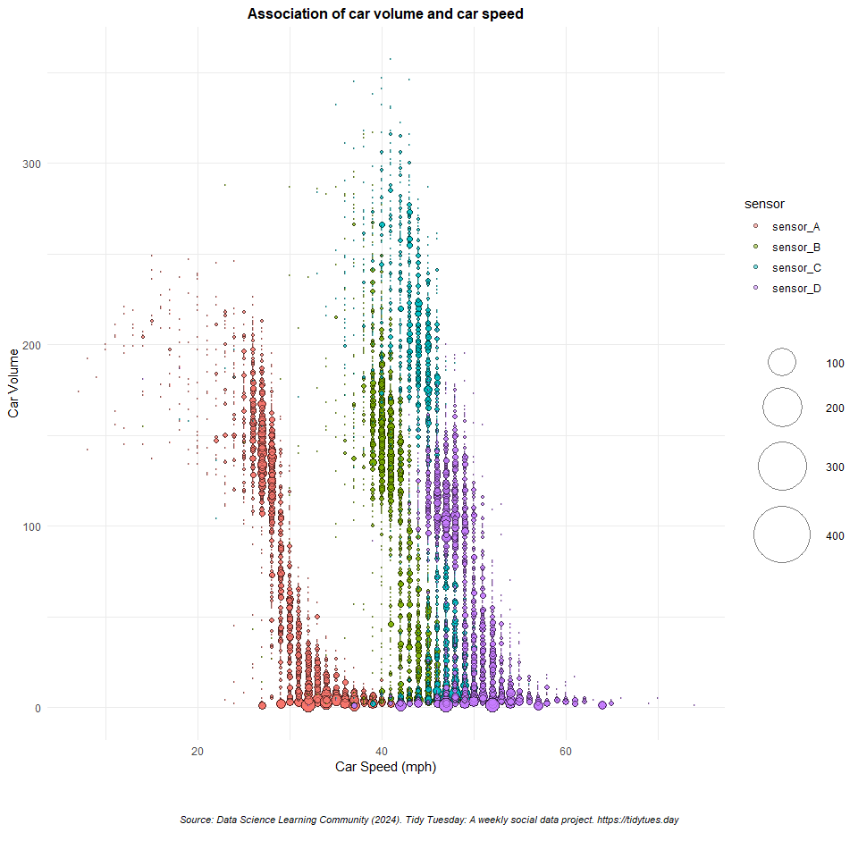

Tidy Tuesday - Highway Traffic Flow
================
Retno K. Ningrum
2024-12-07

#### Load all libraries

``` r
library(tidyverse)    #use ggplot and dplyr package 
#library(here)         #to call data
library(performance)   #to use the check_model function
#library(modelsummary) #for checking model summary
library(mgcv)        #for Generalize Additive Model
library(gridExtra)    #to combine 2 plot in one frame
library(grid)         #to add annotation
library(geomtextpath) #to add text in the linear model line
```

#### Read the data

``` r
A64_traffic <- readr::read_csv('https://raw.githubusercontent.com/rfordatascience/tidytuesday/main/data/2024/2024-12-03/A64_traffic.csv')
```

#### view data

``` r
glimpse(A64_traffic)          #check the data
```

    ## Rows: 11,904
    ## Columns: 29
    ## $ SiteId               <dbl> 6867, 6867, 6867, 6867, 6867, 6867, 6867, 6867, 6…
    ## $ `Site Name`          <dbl> 30361338, 30361338, 30361338, 30361338, 30361338,…
    ## $ `Report Date`        <dttm> 2021-05-01, 2021-05-01, 2021-05-01, 2021-05-01, …
    ## $ `Time Period Ending` <time> 00:14:00, 00:29:00, 00:44:00, 00:59:00, 01:14:00…
    ## $ `Time Interval`      <dbl> 0, 1, 2, 3, 4, 5, 6, 7, 8, 9, 10, 11, 12, 13, 14,…
    ## $ `0 - 520 cm`         <dbl> 9, 5, 5, 4, 2, 3, 2, 0, 1, 1, 0, 0, 2, 0, 1, 1, 0…
    ## $ `521 - 660 cm`       <dbl> 0, 0, 0, 0, 0, 0, 0, 0, 0, 0, 0, 0, 0, 0, 0, 0, 0…
    ## $ `661 - 1160 cm`      <dbl> 0, 0, 1, 3, 0, 1, 3, 1, 0, 0, 0, 0, 0, 0, 0, 1, 1…
    ## $ `1160+ cm`           <dbl> 1, 1, 0, 0, 0, 2, 3, 0, 1, 0, 1, 3, 3, 0, 1, 0, 1…
    ## $ `0 - 10 mph`         <dbl> 0, 0, 0, 0, 0, 0, 0, 0, 0, 0, 0, 0, 0, 0, 0, 0, 0…
    ## $ `11 - 15 mph`        <dbl> 0, 0, 0, 0, 0, 0, 0, 0, 0, 0, 0, 0, 0, 0, 0, 0, 0…
    ## $ `16 - 20 mph`        <dbl> 0, 0, 0, 0, 0, 0, 0, 0, 0, 0, 0, 0, 0, 0, 0, 0, 0…
    ## $ `21 - 25 mph`        <dbl> 0, 0, 0, 0, 0, 0, 0, 0, 0, 0, 0, 0, 0, 0, 0, 0, 0…
    ## $ `26 - 30 mph`        <dbl> 2, 1, 2, 1, 0, 1, 0, 0, 1, 0, 0, 0, 0, 0, 0, 0, 1…
    ## $ `31 - 35 mph`        <dbl> 5, 2, 0, 2, 0, 2, 3, 0, 0, 1, 1, 2, 0, 0, 1, 0, 0…
    ## $ `36 - 40 mph`        <dbl> 1, 2, 1, 3, 1, 1, 2, 0, 0, 0, 0, 1, 0, 0, 0, 2, 0…
    ## $ `41 - 45 mph`        <dbl> 1, 0, 1, 1, 1, 2, 1, 1, 0, 0, 0, 0, 2, 0, 0, 0, 1…
    ## $ `46 - 50 mph`        <dbl> 0, 0, 0, 0, 0, 0, 0, 0, 1, 0, 0, 0, 0, 0, 1, 0, 0…
    ## $ `51 - 55 mph`        <dbl> 0, 1, 1, 0, 0, 0, 1, 0, 0, 0, 0, 0, 2, 0, 0, 0, 0…
    ## $ `56 - 60 mph`        <dbl> 0, 0, 0, 0, 0, 0, 0, 0, 0, 0, 0, 0, 0, 0, 0, 0, 0…
    ## $ `61 - 70 mph`        <dbl> 1, 0, 1, 0, 0, 0, 0, 0, 0, 0, 0, 0, 1, 0, 0, 0, 0…
    ## $ `71 - 80 mph`        <dbl> 0, 0, 0, 0, 0, 0, 1, 0, 0, 0, 0, 0, 0, 0, 0, 0, 0…
    ## $ `80+ mph`            <dbl> 0, 0, 0, 0, 0, 0, 0, 0, 0, 0, 0, 0, 0, 0, 0, 0, 0…
    ## $ `Avg mph`            <dbl> 34, 35, 38, 34, 39, 34, 39, 42, 34, 32, 32, 34, 4…
    ## $ `Total Volume`       <dbl> 10, 6, 6, 7, 2, 6, 8, 1, 2, 1, 1, 3, 5, 0, 2, 2, …
    ## $ Name                 <chr> "TAME Site 30361338 on link A64 eastbound between…
    ## $ Longitude            <dbl> -0.6946696, -0.6946696, -0.6946696, -0.6946696, -…
    ## $ Latitude             <dbl> 54.1581, 54.1581, 54.1581, 54.1581, 54.1581, 54.1…
    ## $ Status               <chr> "Active", "Active", "Active", "Active", "Active",…

``` r
unique(A64_traffic$Name)      #check the category in name of the sensor
```

    ## [1] "TAME Site 30361338 on link A64 eastbound between B1248 near Norton-on-Derwent (east) and B1249- GPS Ref: 485338-474373- Eastbound"                  
    ## [2] "TAME Site 30361451 on link A64 eastbound between B1249 and A1039- GPS Ref: 501900-479108- Eastbound"                                                
    ## [3] "TAME Site 30361466 on link A64 eastbound between A1237 near York (north) and B1248 near Norton-on-Derwent (west)- GPS Ref: 476581-469941- Eastbound"
    ## [4] "TAME Site 30361486 on link A64 eastbound between B1261 and Filey- GPS Ref: 502756-483134- Eastbound"

After viewing the data, I decide to create examine whether there is any
relation between average speed of the car to the total volume of the
car. Then I will look further by adding interaction to the Name of
sensor, to see whether sensor has significant different in reading the
data or not.

#### Manipulate the data

``` r
#Simplify the data 
data <- A64_traffic %>%
  select(`Avg mph`, `Total Volume`, Name) %>%   #only select these column
  mutate(sensor = case_when(                    #I rename the sensor because its too long
    Name == "TAME Site 30361338 on link A64 eastbound between B1248 near Norton-on-Derwent (east) and B1249- GPS Ref: 485338-474373- Eastbound" ~ "sensor_A",
    Name == "TAME Site 30361451 on link A64 eastbound between B1249 and A1039- GPS Ref: 501900-479108- Eastbound" ~ "sensor_B",
    Name == "TAME Site 30361466 on link A64 eastbound between A1237 near York (north) and B1248 near Norton-on-Derwent (west)- GPS Ref: 476581-469941- Eastbound" ~ "sensor_C",
    Name == "TAME Site 30361486 on link A64 eastbound between B1261 and Filey- GPS Ref: 502756-483134- Eastbound" ~ "sensor_D",
    TRUE ~ NA_character_                       #Handle unmatched cases with NA
  )) %>%
  select(- Name) %>%                           #Unselect Name
  rename(                                      #Rename the column
    avg_mph = 'Avg mph',
    Total_Volume = 'Total Volume'
  )
```

### create the model

``` r
model <- lm(Total_Volume ~ avg_mph * sensor, data = data)
summary(model) #check the summary of the model
```

    ## 
    ## Call:
    ## lm(formula = Total_Volume ~ avg_mph * sensor, data = data)
    ## 
    ## Residuals:
    ##     Min      1Q  Median      3Q     Max 
    ## -412.38  -34.91    0.59   36.45  258.53 
    ## 
    ## Coefficients:
    ##                        Estimate Std. Error t value Pr(>|t|)    
    ## (Intercept)            376.6791     5.8147  64.780  < 2e-16 ***
    ## avg_mph                 -9.9095     0.1920 -51.625  < 2e-16 ***
    ## sensorsensor_B         214.9281    12.1018  17.760  < 2e-16 ***
    ## sensorsensor_C         494.7856    14.1786  34.897  < 2e-16 ***
    ## sensorsensor_D          29.1648    14.6938   1.985   0.0472 *  
    ## avg_mph:sensorsensor_B  -1.8524     0.3118  -5.941 2.93e-09 ***
    ## avg_mph:sensorsensor_C  -6.7619     0.3427 -19.730  < 2e-16 ***
    ## avg_mph:sensorsensor_D   2.9665     0.3337   8.891  < 2e-16 ***
    ## ---
    ## Signif. codes:  0 '***' 0.001 '**' 0.01 '*' 0.05 '.' 0.1 ' ' 1
    ## 
    ## Residual standard error: 53.78 on 10411 degrees of freedom
    ##   (1485 observations deleted due to missingness)
    ## Multiple R-squared:  0.496,  Adjusted R-squared:  0.4956 
    ## F-statistic:  1464 on 7 and 10411 DF,  p-value: < 2.2e-16

before I conclude the association between the speed and total volume
between 4 different sensor, I will check the model assumption

``` r
check_model(model)  #check model assumption
```

<!-- --> \### Review model
assumption check

**Posterior Predictive Check**  
this part compares the distribution of observed data and model predicted
data, the observed (blue) and oredicted (green) distribution is not
align well, suggesting the model may not fully capture the data
distribution. To deal with this issue, I will add log or square root
transformations to improve the fit.  
**Linearity**  
it shows residual vs fitted values. The reference line is not horizontal
and flat, showing a distinct non linear pattern in residual. Therefore,
I will try different type of model. I will try to use GAM (General
Additive Model) to account for the nonlinearity.  
**Homogenity of Variance**  
It shows the residual did not have consistent spread across fitted
value. So I will add the log transformation in the model to account for
the varying variance.  
**Influential Observations**  
It seems all point were fall within the contour line  
**Collinearity**  
the interaction between speed and sensor shows extremely high VIF. I
will consider dropping sensor term to see the association between volume
of the car to the speed average.  
**Normality of Residuals**  
residual deviate from the line, especially at the tails, indicate
non-normality. this strengthen my consideration to apply transformations
to the response variable.

### GAM model with interaction

``` r
#check type of data
str(data$sensor)
```

    ##  chr [1:11904] "sensor_A" "sensor_A" "sensor_A" "sensor_A" "sensor_A" ...

``` r
#change sensor as factor
data$sensor <- as.factor(data$sensor)

#create the model gam
GAM_model <- gam(log(Total_Volume) ~ s(avg_mph) + sensor + s(avg_mph, by = sensor), data = data)

#check again model assumption
check_model(GAM_model)
```

<!-- --> after checking the
model assumption, it seems that sensor have resulting high VIF. so, I
will drop the sensor from the model, as my primary goal is to find
whether the car volume has and speed have any association or not.

``` r
#create the model gam
GAM_model2 <- gam(log(Total_Volume) ~ s(avg_mph), data = data)

#check again model assumption
check_model(GAM_model2)
```

<!-- --> after checking the
model, there is an improvement where in the posterior predictive check
graph shows the predicted line closely resemble the observed data line.
the linearity and homogenity of variance also seems more horizontal and
flat, althoug this horizontal line dispersed in the tail part (beyond 5
fitted value). This suggest there is improvement in my model but the
model still has limitations. adding other predictors that might
associate with the pattern should be considered. But in the mean time, I
will draw my conclusion between the relation of car volume and speed
based on GAM_model2.

``` r
#view the summary of GAM_model2
summary(GAM_model2)
```

    ## 
    ## Family: gaussian 
    ## Link function: identity 
    ## 
    ## Formula:
    ## log(Total_Volume) ~ s(avg_mph)
    ## 
    ## Parametric coefficients:
    ##             Estimate Std. Error t value Pr(>|t|)    
    ## (Intercept)  3.71245    0.01266   293.3   <2e-16 ***
    ## ---
    ## Signif. codes:  0 '***' 0.001 '**' 0.01 '*' 0.05 '.' 0.1 ' ' 1
    ## 
    ## Approximate significance of smooth terms:
    ##              edf Ref.df     F p-value    
    ## s(avg_mph) 8.918  8.997 444.6  <2e-16 ***
    ## ---
    ## Signif. codes:  0 '***' 0.001 '**' 0.01 '*' 0.05 '.' 0.1 ' ' 1
    ## 
    ## R-sq.(adj) =  0.277   Deviance explained = 27.8%
    ## GCV = 1.6709  Scale est. = 1.6693    n = 10419

The model shows a strong, statistically significant relationship between
car speed and log(car volume). However, the relatively low R-squared
(27.7%) suggests that there is still a substantial amount of unexplained
variability, potentially due to other predictors not included in the
model or random noise. \### Create Data Visualization

``` r
#add new column to calculate the frequency of the each groupping
data <- data %>%
  group_by(avg_mph, Total_Volume, sensor) %>%  #group the data
  mutate(frequency = n())                      #calculate the frequency of grouped data

#Visualize the data
plot <- ggplot(data = data,             #use data as data 
               aes(x = avg_mph,         #assign speed as the x axis
                   y = Total_Volume,    #assign car volume as the y axis
                   size = frequency,    #assign frequency as the size
                   fill = sensor)) +    #assign sensor as the fill
  geom_point(alpha = 0.5, shape = 21, color = "black") +  #set the geom point
  scale_size(range = c(.1, 24), name = "") +  #adjust the size range of the geom point
  theme_minimal() +                           #use this type of theme
  theme(legend.position = "right") +          #place legen in the right side
   labs(
    title = "Association of car volume and car speed",  #set the tittle
    x = "Car Speed (mph)",                              #add x axis text            
    y = "Car Volume") +                                 #add y axis text
  theme(
    plot.title = element_text(hjust = 0.5,           #for title, put in the center alignment
                              face = "bold",         #then bold the title
                              size = 12))            #then set the size
  
#Create annotation (the source of the data)
source_text <- textGrob(
  "Source: Data Science Learning Community (2024). Tidy Tuesday: A weekly social data project. https://tidytues.day", 
  gp = gpar(fontsize = 8, fontface = "italic"),  #Adjust Font size and style
  hjust = 0.5,                                    #Center the text horizontally
  x = 0.5                                         #Position it in the center
)

#now arrange all the plots
grid.arrange(
  plot,                #set up layout, first row
  source_text,          #add source_text in the second row
  nrow = 2,             #set up total row : 3 
  ncol = 1,             #set total column is 1
  heights = c(10,1))   #adjust heights in first main row 10, and second row is 1
```

<!-- -->
