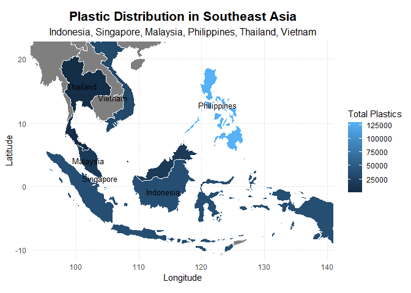

Homework Week 7
================
Retno K. Ningrum
2024-10-09

# Creating Map with R

This assignment use [Plastic Pollution
Dataset](https://raw.githubusercontent.com/rfordatascience/tidytuesday/master/data/2021/2021-01-26/plastics.csv)
with specific countries in Southeast Asia (*Indonesia, Singapore,
Malaysia, Philippines, Thailand, Vietnam, Cambodia, Laos,
China,Timor-Leste, Myanmar*).

## Overall Steps Summary

1.  Filter data plastic from Southeast Asia (SEA) country and then sum
    all the total plastic in each country
2.  Filter world data using country mentioned in plastic data in SEA
3.  Join the plastic data in SEA with the world data
4.  Create text for each country label manually, following the
    coordinate of each country
5.  create the plot!

### Load Libraries

load all necessary libraries

``` r
library(tidyverse)
library(here)
library(maps)
library(mapdata)
library(mapproj)
```

### Load and Inspect the Data

``` r
#Read the plastic data
plastics <- readr::read_csv('https://raw.githubusercontent.com/rfordatascience/tidytuesday/master/data/2021/2021-01-26/plastics.csv')

#Read the world data (for mapping)
world <- map_data("world")

#Check the first 10 data
head(plastics)
```

    ## # A tibble: 6 × 14
    ##   country    year parent_company empty  hdpe  ldpe     o   pet    pp    ps   pvc
    ##   <chr>     <dbl> <chr>          <dbl> <dbl> <dbl> <dbl> <dbl> <dbl> <dbl> <dbl>
    ## 1 Argentina  2019 Grand Total        0   215    55   607  1376   281   116    18
    ## 2 Argentina  2019 Unbranded          0   155    50   532   848   122   114    17
    ## 3 Argentina  2019 The Coca-Cola…     0     0     0     0   222    35     0     0
    ## 4 Argentina  2019 Secco              0     0     0     0    39     4     0     0
    ## 5 Argentina  2019 Doble Cola         0     0     0     0    38     0     0     0
    ## 6 Argentina  2019 Pritty             0     0     0     0    22     7     0     0
    ## # ℹ 3 more variables: grand_total <dbl>, num_events <dbl>, volunteers <dbl>

``` r
head(world)
```

    ##        long      lat group order region subregion
    ## 1 -69.89912 12.45200     1     1  Aruba      <NA>
    ## 2 -69.89571 12.42300     1     2  Aruba      <NA>
    ## 3 -69.94219 12.43853     1     3  Aruba      <NA>
    ## 4 -70.00415 12.50049     1     4  Aruba      <NA>
    ## 5 -70.06612 12.54697     1     5  Aruba      <NA>
    ## 6 -70.05088 12.59707     1     6  Aruba      <NA>

``` r
#check overall data
glimpse(plastics)
```

    ## Rows: 13,380
    ## Columns: 14
    ## $ country        <chr> "Argentina", "Argentina", "Argentina", "Argentina", "Ar…
    ## $ year           <dbl> 2019, 2019, 2019, 2019, 2019, 2019, 2019, 2019, 2019, 2…
    ## $ parent_company <chr> "Grand Total", "Unbranded", "The Coca-Cola Company", "S…
    ## $ empty          <dbl> 0, 0, 0, 0, 0, 0, 0, 0, 0, 0, 0, 0, 0, 0, 0, 0, 0, 0, 0…
    ## $ hdpe           <dbl> 215, 155, 0, 0, 0, 0, 0, 0, 0, 0, 0, 0, 0, 0, 0, 0, 0, …
    ## $ ldpe           <dbl> 55, 50, 0, 0, 0, 0, 0, 0, 0, 0, 0, 0, 0, 0, 0, 0, 0, 0,…
    ## $ o              <dbl> 607, 532, 0, 0, 0, 0, 0, 0, 0, 0, 0, 0, 0, 13, 0, 0, 0,…
    ## $ pet            <dbl> 1376, 848, 222, 39, 38, 22, 21, 26, 19, 14, 14, 14, 14,…
    ## $ pp             <dbl> 281, 122, 35, 4, 0, 7, 6, 0, 1, 4, 3, 1, 0, 0, 3, 0, 4,…
    ## $ ps             <dbl> 116, 114, 0, 0, 0, 0, 0, 0, 0, 0, 0, 0, 0, 0, 0, 0, 0, …
    ## $ pvc            <dbl> 18, 17, 0, 0, 0, 0, 0, 0, 0, 0, 0, 0, 0, 0, 0, 0, 0, 0,…
    ## $ grand_total    <dbl> 2668, 1838, 257, 43, 38, 29, 27, 26, 20, 18, 17, 15, 14…
    ## $ num_events     <dbl> 4, 4, 4, 4, 4, 4, 4, 4, 4, 4, 4, 4, 4, 4, 4, 4, 4, 4, 4…
    ## $ volunteers     <dbl> 243, 243, 243, 243, 243, 243, 243, 243, 243, 243, 243, …

``` r
glimpse(world)
```

    ## Rows: 99,338
    ## Columns: 6
    ## $ long      <dbl> -69.89912, -69.89571, -69.94219, -70.00415, -70.06612, -70.0…
    ## $ lat       <dbl> 12.45200, 12.42300, 12.43853, 12.50049, 12.54697, 12.59707, …
    ## $ group     <dbl> 1, 1, 1, 1, 1, 1, 1, 1, 1, 1, 2, 2, 2, 2, 2, 2, 2, 2, 2, 2, …
    ## $ order     <int> 1, 2, 3, 4, 5, 6, 7, 8, 9, 10, 12, 13, 14, 15, 16, 17, 18, 1…
    ## $ region    <chr> "Aruba", "Aruba", "Aruba", "Aruba", "Aruba", "Aruba", "Aruba…
    ## $ subregion <chr> NA, NA, NA, NA, NA, NA, NA, NA, NA, NA, NA, NA, NA, NA, NA, …

``` r
unique(plastics$country)  #to check the list of country covered in the plastics data
```

    ##  [1] "Argentina"                                         
    ##  [2] "Australia"                                         
    ##  [3] "Bangladesh"                                        
    ##  [4] "Benin"                                             
    ##  [5] "Bhutan"                                            
    ##  [6] "Brazil"                                            
    ##  [7] "Bulgaria"                                          
    ##  [8] "Burkina Faso"                                      
    ##  [9] "Cameroon"                                          
    ## [10] "Canada"                                            
    ## [11] "China"                                             
    ## [12] "Colombia"                                          
    ## [13] "Cote D_ivoire"                                     
    ## [14] "Cyprus"                                            
    ## [15] "ECUADOR"                                           
    ## [16] "EMPTY"                                             
    ## [17] "France"                                            
    ## [18] "Germany"                                           
    ## [19] "Ghana"                                             
    ## [20] "Hong Kong"                                         
    ## [21] "India"                                             
    ## [22] "Indonesia"                                         
    ## [23] "Ireland"                                           
    ## [24] "Italy"                                             
    ## [25] "Japan"                                             
    ## [26] "Kenya"                                             
    ## [27] "Latvia"                                            
    ## [28] "Luxembourg"                                        
    ## [29] "Malaysia"                                          
    ## [30] "Maldives"                                          
    ## [31] "Mexico"                                            
    ## [32] "Montenegro"                                        
    ## [33] "NIGERIA"                                           
    ## [34] "Netherlands"                                       
    ## [35] "Philippines"                                       
    ## [36] "Portugal"                                          
    ## [37] "Rwanda"                                            
    ## [38] "Slovenia"                                          
    ## [39] "South Africa"                                      
    ## [40] "Spain"                                             
    ## [41] "Sri Lanka"                                         
    ## [42] "Switzerland"                                       
    ## [43] "Taiwan_ Republic of China (ROC)"                   
    ## [44] "Tanzania"                                          
    ## [45] "Thailand"                                          
    ## [46] "Tunisia"                                           
    ## [47] "Turkey"                                            
    ## [48] "Ukraine"                                           
    ## [49] "United Arab Emirates"                              
    ## [50] "United Kingdom"                                    
    ## [51] "United States of America"                          
    ## [52] "Vietnam"                                           
    ## [53] "Armenia"                                           
    ## [54] "Chile"                                             
    ## [55] "Denmark"                                           
    ## [56] "Ecuador"                                           
    ## [57] "El Salvador"                                       
    ## [58] "Greece"                                            
    ## [59] "Honduras"                                          
    ## [60] "Korea"                                             
    ## [61] "Kuwait"                                            
    ## [62] "Lithuania"                                         
    ## [63] "Nigeria"                                           
    ## [64] "Peru"                                              
    ## [65] "Romania"                                           
    ## [66] "Serbia"                                            
    ## [67] "Singapore"                                         
    ## [68] "Togo"                                              
    ## [69] "United Kingdom of Great Britain & Northern Ireland"

``` r
unique(world$region)      #to check the list of country covered in the world data
```

    ##   [1] "Aruba"                              
    ##   [2] "Afghanistan"                        
    ##   [3] "Angola"                             
    ##   [4] "Anguilla"                           
    ##   [5] "Albania"                            
    ##   [6] "Finland"                            
    ##   [7] "Andorra"                            
    ##   [8] "United Arab Emirates"               
    ##   [9] "Argentina"                          
    ##  [10] "Armenia"                            
    ##  [11] "American Samoa"                     
    ##  [12] "Antarctica"                         
    ##  [13] "Australia"                          
    ##  [14] "French Southern and Antarctic Lands"
    ##  [15] "Antigua"                            
    ##  [16] "Barbuda"                            
    ##  [17] "Austria"                            
    ##  [18] "Azerbaijan"                         
    ##  [19] "Burundi"                            
    ##  [20] "Belgium"                            
    ##  [21] "Benin"                              
    ##  [22] "Burkina Faso"                       
    ##  [23] "Bangladesh"                         
    ##  [24] "Bulgaria"                           
    ##  [25] "Bahrain"                            
    ##  [26] "Bahamas"                            
    ##  [27] "Bosnia and Herzegovina"             
    ##  [28] "Saint Barthelemy"                   
    ##  [29] "Belarus"                            
    ##  [30] "Belize"                             
    ##  [31] "Bermuda"                            
    ##  [32] "Bolivia"                            
    ##  [33] "Brazil"                             
    ##  [34] "Barbados"                           
    ##  [35] "Brunei"                             
    ##  [36] "Bhutan"                             
    ##  [37] "Botswana"                           
    ##  [38] "Central African Republic"           
    ##  [39] "Canada"                             
    ##  [40] "Switzerland"                        
    ##  [41] "Chile"                              
    ##  [42] "China"                              
    ##  [43] "Ivory Coast"                        
    ##  [44] "Cameroon"                           
    ##  [45] "Democratic Republic of the Congo"   
    ##  [46] "Republic of Congo"                  
    ##  [47] "Cook Islands"                       
    ##  [48] "Colombia"                           
    ##  [49] "Comoros"                            
    ##  [50] "Cape Verde"                         
    ##  [51] "Costa Rica"                         
    ##  [52] "Cuba"                               
    ##  [53] "Curacao"                            
    ##  [54] "Cayman Islands"                     
    ##  [55] "Cyprus"                             
    ##  [56] "Czech Republic"                     
    ##  [57] "Germany"                            
    ##  [58] "Djibouti"                           
    ##  [59] "Dominica"                           
    ##  [60] "Denmark"                            
    ##  [61] "Dominican Republic"                 
    ##  [62] "Algeria"                            
    ##  [63] "Ecuador"                            
    ##  [64] "Egypt"                              
    ##  [65] "Eritrea"                            
    ##  [66] "Canary Islands"                     
    ##  [67] "Spain"                              
    ##  [68] "Estonia"                            
    ##  [69] "Ethiopia"                           
    ##  [70] "Fiji"                               
    ##  [71] "Falkland Islands"                   
    ##  [72] "Reunion"                            
    ##  [73] "Mayotte"                            
    ##  [74] "French Guiana"                      
    ##  [75] "Martinique"                         
    ##  [76] "Guadeloupe"                         
    ##  [77] "France"                             
    ##  [78] "Faroe Islands"                      
    ##  [79] "Micronesia"                         
    ##  [80] "Gabon"                              
    ##  [81] "UK"                                 
    ##  [82] "Georgia"                            
    ##  [83] "Guernsey"                           
    ##  [84] "Ghana"                              
    ##  [85] "Guinea"                             
    ##  [86] "Gambia"                             
    ##  [87] "Guinea-Bissau"                      
    ##  [88] "Equatorial Guinea"                  
    ##  [89] "Greece"                             
    ##  [90] "Grenada"                            
    ##  [91] "Greenland"                          
    ##  [92] "Guatemala"                          
    ##  [93] "Guam"                               
    ##  [94] "Guyana"                             
    ##  [95] "Heard Island"                       
    ##  [96] "Honduras"                           
    ##  [97] "Croatia"                            
    ##  [98] "Haiti"                              
    ##  [99] "Hungary"                            
    ## [100] "Indonesia"                          
    ## [101] "Isle of Man"                        
    ## [102] "India"                              
    ## [103] "Cocos Islands"                      
    ## [104] "Christmas Island"                   
    ## [105] "Chagos Archipelago"                 
    ## [106] "Ireland"                            
    ## [107] "Iran"                               
    ## [108] "Iraq"                               
    ## [109] "Iceland"                            
    ## [110] "Israel"                             
    ## [111] "Italy"                              
    ## [112] "San Marino"                         
    ## [113] "Jamaica"                            
    ## [114] "Jersey"                             
    ## [115] "Jordan"                             
    ## [116] "Japan"                              
    ## [117] "Siachen Glacier"                    
    ## [118] "Kazakhstan"                         
    ## [119] "Kenya"                              
    ## [120] "Kyrgyzstan"                         
    ## [121] "Cambodia"                           
    ## [122] "Kiribati"                           
    ## [123] "Nevis"                              
    ## [124] "Saint Kitts"                        
    ## [125] "South Korea"                        
    ## [126] "Kosovo"                             
    ## [127] "Kuwait"                             
    ## [128] "Laos"                               
    ## [129] "Lebanon"                            
    ## [130] "Liberia"                            
    ## [131] "Libya"                              
    ## [132] "Saint Lucia"                        
    ## [133] "Liechtenstein"                      
    ## [134] "Sri Lanka"                          
    ## [135] "Lesotho"                            
    ## [136] "Lithuania"                          
    ## [137] "Luxembourg"                         
    ## [138] "Latvia"                             
    ## [139] "Saint Martin"                       
    ## [140] "Morocco"                            
    ## [141] "Monaco"                             
    ## [142] "Moldova"                            
    ## [143] "Madagascar"                         
    ## [144] "Maldives"                           
    ## [145] "Mexico"                             
    ## [146] "Marshall Islands"                   
    ## [147] "North Macedonia"                    
    ## [148] "Mali"                               
    ## [149] "Malta"                              
    ## [150] "Myanmar"                            
    ## [151] "Montenegro"                         
    ## [152] "Mongolia"                           
    ## [153] "Northern Mariana Islands"           
    ## [154] "Mozambique"                         
    ## [155] "Mauritania"                         
    ## [156] "Montserrat"                         
    ## [157] "Mauritius"                          
    ## [158] "Malawi"                             
    ## [159] "Malaysia"                           
    ## [160] "Namibia"                            
    ## [161] "New Caledonia"                      
    ## [162] "Niger"                              
    ## [163] "Norfolk Island"                     
    ## [164] "Nigeria"                            
    ## [165] "Nicaragua"                          
    ## [166] "Niue"                               
    ## [167] "Bonaire"                            
    ## [168] "Sint Eustatius"                     
    ## [169] "Saba"                               
    ## [170] "Netherlands"                        
    ## [171] "Norway"                             
    ## [172] "Nepal"                              
    ## [173] "Nauru"                              
    ## [174] "New Zealand"                        
    ## [175] "Oman"                               
    ## [176] "Pakistan"                           
    ## [177] "Panama"                             
    ## [178] "Pitcairn Islands"                   
    ## [179] "Peru"                               
    ## [180] "Philippines"                        
    ## [181] "Palau"                              
    ## [182] "Papua New Guinea"                   
    ## [183] "Poland"                             
    ## [184] "Puerto Rico"                        
    ## [185] "North Korea"                        
    ## [186] "Madeira Islands"                    
    ## [187] "Azores"                             
    ## [188] "Portugal"                           
    ## [189] "Paraguay"                           
    ## [190] "Palestine"                          
    ## [191] "French Polynesia"                   
    ## [192] "Qatar"                              
    ## [193] "Romania"                            
    ## [194] "Russia"                             
    ## [195] "Rwanda"                             
    ## [196] "Western Sahara"                     
    ## [197] "Saudi Arabia"                       
    ## [198] "Sudan"                              
    ## [199] "South Sudan"                        
    ## [200] "Senegal"                            
    ## [201] "Singapore"                          
    ## [202] "South Sandwich Islands"             
    ## [203] "South Georgia"                      
    ## [204] "Saint Helena"                       
    ## [205] "Ascension Island"                   
    ## [206] "Solomon Islands"                    
    ## [207] "Sierra Leone"                       
    ## [208] "El Salvador"                        
    ## [209] "Somalia"                            
    ## [210] "Saint Pierre and Miquelon"          
    ## [211] "Serbia"                             
    ## [212] "Sao Tome and Principe"              
    ## [213] "Suriname"                           
    ## [214] "Slovakia"                           
    ## [215] "Slovenia"                           
    ## [216] "Sweden"                             
    ## [217] "Swaziland"                          
    ## [218] "Sint Maarten"                       
    ## [219] "Seychelles"                         
    ## [220] "Syria"                              
    ## [221] "Turks and Caicos Islands"           
    ## [222] "Chad"                               
    ## [223] "Togo"                               
    ## [224] "Thailand"                           
    ## [225] "Tajikistan"                         
    ## [226] "Turkmenistan"                       
    ## [227] "Timor-Leste"                        
    ## [228] "Tonga"                              
    ## [229] "Trinidad"                           
    ## [230] "Tobago"                             
    ## [231] "Tunisia"                            
    ## [232] "Turkey"                             
    ## [233] "Taiwan"                             
    ## [234] "Tanzania"                           
    ## [235] "Uganda"                             
    ## [236] "Ukraine"                            
    ## [237] "Uruguay"                            
    ## [238] "USA"                                
    ## [239] "Uzbekistan"                         
    ## [240] "Vatican"                            
    ## [241] "Grenadines"                         
    ## [242] "Saint Vincent"                      
    ## [243] "Venezuela"                          
    ## [244] "Virgin Islands"                     
    ## [245] "Vietnam"                            
    ## [246] "Vanuatu"                            
    ## [247] "Wallis and Futuna"                  
    ## [248] "Samoa"                              
    ## [249] "Yemen"                              
    ## [250] "South Africa"                       
    ## [251] "Zambia"                             
    ## [252] "Zimbabwe"

After checking the dataset, I decide to focus on creating map of plastic
distribution in Southeast Asia

### Data Cleaning

``` r
#create the SouthEast Asia (SEA) dataset for map background
SEA <- world %>%                                                    #use world data
  filter(region %in% c("Indonesia", "Singapore", "Malaysia",        #filter data in region column
                       "Philippines", "Thailand", "Vietnam", 
                       "Cambodia", "Laos", "China", "Timor-Leste", 
                       "Myanmar")) %>%
  select(long, lat, group, region)                          #select only long, lat, group, region column


#create the plastic data in SEA
plastic_SEA <- plastics %>%                          #use plastic data
  filter(country %in% c("Indonesia", "Singapore",    #filter country in SEA
                        "Malaysia", "Philippines", 
                        "Thailand", "Vietnam")) %>%          
  select("region" = country,  #Select the country column, but rename it to "region" -> for join purposes
         grand_total) %>%     #select the grand_total value    
  group_by(region)  %>%       #group by region
  summarise(total_plastics = sum(grand_total))  #summarize grand_total in each country/region

#Join the plastic in SEA with SEA
SEA_plastic <- left_join(SEA, plastic_SEA)

#Create label for the map
country_labels <- data.frame(
  region = c("Indonesia", "Malaysia", "Philippines",  #show the label for these countries
             "Singapore", "Thailand", "Vietnam"),
  long = c(113.9213, 101.9758, 122.5583, 103.8198, 100.9925, 105.8562), # set longitudes of each country label
  lat = c(-0.7893, 4.2105, 12.8797, 1.3521, 15.8700, 14.0583)        # set latitude if each country label
)
```

### Plot the Map!

``` r
# Plot the map
ggplot(data = SEA_plastic) +                          #use data world_indo as the plot background
  geom_polygon(aes(x = long, y = lat,                 #create polygon using x.y coordinate
                   group = group,                     #group by group
                   fill = total_plastics),            #fill data using total_plastics
               color = "white") +                     #country border is white
  geom_text(data = country_labels,                    #use data from country_labels
            aes(x = long, y = lat,                    #set text by long and lat axis
                label = region),                      #label text by region
            size = 3.5,  color = "black") +           #set the size by 3.5, text color is black
  coord_map(projection = "mercator", #Use the mercator type as projected map
            xlim = c(95, 139),       #set the x coordinate from 95 to 139 (this is indonesia coordinate) 
            ylim = c(-10, 21)) +     #set the y coordinate from -10 to 12 (this is indonesia coordinate)
  labs(title = "Plastic Distribution in Southeast Asia",  #Add title
       subtitle = "Indonesia, Singapore, Malaysia, Philippines, Thailand, Vietnam",   #Add subtitle
       x = "Longitude",                                   #Add X-axis label
       y = "Latitude",                                    #Add Y-axis label
       fill = "Total Plastics") +                         #Add legend title
  theme_minimal() +                                       #Apply minimal theme for clean appearance
  theme(panel.grid.major = element_line(color = "gray",       #Add gridline, color grey
                                        linetype = "dotted"), #set type of gridline: dotted gridline
        plot.title = element_text(hjust = 0.5,     #place the title text in the center
                                  size = 16,       #Set font size = 16
                                  face = "bold"),
        plot.subtitle = element_text(hjust = 0.5,  #place the subtitle text in the center
                                  size = 12 ))     #Set font size = 12
```

<!-- -->
