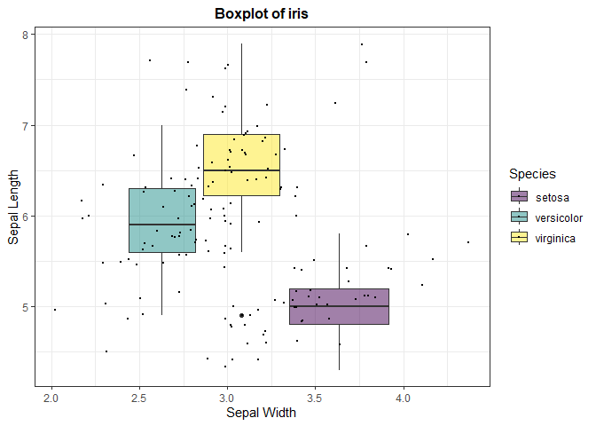
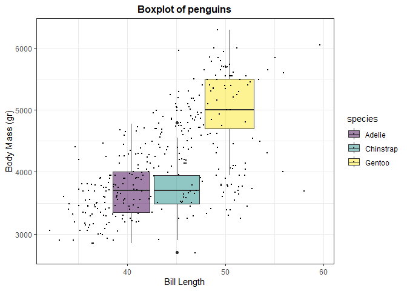

Homework
================
Retno K. Ningrum
2024-10-23

## Intall all libraries

``` r
library(ggplot2)
library(palmerpenguins)
library(dplyr)
```

    ## 
    ## Attaching package: 'dplyr'

    ## The following objects are masked from 'package:stats':
    ## 
    ##     filter, lag

    ## The following objects are masked from 'package:base':
    ## 
    ##     intersect, setdiff, setequal, union

``` r
library(tidyverse)
```

    ## ── Attaching core tidyverse packages ──────────────────────── tidyverse 2.0.0 ──
    ## ✔ forcats   1.0.0     ✔ stringr   1.5.1
    ## ✔ lubridate 1.9.3     ✔ tibble    3.2.1
    ## ✔ purrr     1.0.2     ✔ tidyr     1.3.1
    ## ✔ readr     2.1.5

    ## ── Conflicts ────────────────────────────────────────── tidyverse_conflicts() ──
    ## ✖ dplyr::filter() masks stats::filter()
    ## ✖ dplyr::lag()    masks stats::lag()
    ## ℹ Use the conflicted package (<http://conflicted.r-lib.org/>) to force all conflicts to become errors

``` r
library(hrbrthemes)
library(viridis)
```

    ## Loading required package: viridisLite

## view the data

``` r
glimpse(iris) #I use iris data from R
```

    ## Rows: 150
    ## Columns: 5
    ## $ Sepal.Length <dbl> 5.1, 4.9, 4.7, 4.6, 5.0, 5.4, 4.6, 5.0, 4.4, 4.9, 5.4, 4.…
    ## $ Sepal.Width  <dbl> 3.5, 3.0, 3.2, 3.1, 3.6, 3.9, 3.4, 3.4, 2.9, 3.1, 3.7, 3.…
    ## $ Petal.Length <dbl> 1.4, 1.4, 1.3, 1.5, 1.4, 1.7, 1.4, 1.5, 1.4, 1.5, 1.5, 1.…
    ## $ Petal.Width  <dbl> 0.2, 0.2, 0.2, 0.2, 0.2, 0.4, 0.3, 0.2, 0.2, 0.1, 0.2, 0.…
    ## $ Species      <fct> setosa, setosa, setosa, setosa, setosa, setosa, setosa, s…

## Create a function without plot

Here, I will try to make a function that summarize data: mean, median,
min, and max

``` r
#create the function to calculate mean, median min, and max
basic_stat <- function(x) {         #calling the function "x"
  result <- data.frame(             #to create a data frame
  mean = mean(x, na.rm = TRUE),     #assign the function to calculate mean in "x", delete all NA
  median = median(x, na.rm = TRUE), #assign the function to calculate median in "x", delete all NA
  min = min(x, na.rm = TRUE),       #assign the function to calculate min in "x", delete all NA
  max = max(x, na.rm = TRUE)        #assign the function to calculate max in "x", delete all NA
  )
  return(result)                    #specify in returning the result data frame function
}

#try to calculate basic stats for bill depth length
print(basic_stat(iris$Sepal.Length))  
```

    ##       mean median min max
    ## 1 5.843333    5.8 4.3 7.9

``` r
#try to calculate basic stats for bill length
print(basic_stat(iris$Sepal.Width))
```

    ##       mean median min max
    ## 1 3.057333      3   2 4.4

``` r
#What if I only want to know the Setosa?
#filter the data set to setosa only
setosa<- iris %>%
  filter(Species == "setosa")

#print calculation of setosa width
print(basic_stat(setosa$Sepal.Width))
```

    ##    mean median min max
    ## 1 3.428    3.4 2.3 4.4

``` r
#print calculation of setosa length
print(basic_stat(setosa$Petal.Length))
```

    ##    mean median min max
    ## 1 1.462    1.5   1 1.9

## Create a function with a plot

``` r
boxplot_RN <- function(data, x, y, z) {
  #create plot_title function, to adjust the plot's title on each dataset
  plot_title <- paste("Boxplot of",              #use the "Boxplot of" as a template of title
                      deparse(substitute(data))) #then continue the name based on the dataset used
  
  #create the plot
  ggplot(data, aes(x= {{x}},        #assign x axis based on "x" column
                   y= {{y}},        #assign y axis based on "y" column
                   fill = {{z}}))+  #assign the color based on "z" column
  geom_boxplot() +                  #use geom boxplot
  scale_fill_viridis(discrete = TRUE, #use color based on scale_fill_viridis pallete
                     alpha = 0.5) +   #set the transparency of boxplot
    geom_jitter(color = "black",    #add the data point
                size = 0.4) +       #set the size of data point
    theme_bw() +                    #use theme_bw() for the frame theme
    theme( 
      legend.position = "right",            #place the legend on the right side of figures
      plot.title = element_text(size = 12,  #assign the plot title size 
        face = "bold",                      #Makes the title bold
        hjust = 0.5)                        #Centers the title
    ) +
    ggtitle(plot_title)    #assign the title based on the plot_title function created earlier
}

## Now try use the function to iris dataset
boxplot_RN(iris, Sepal.Width, Sepal.Length, Species)+
  xlab("Sepal Width") +
  ylab("Sepal Length")
```

<!-- -->

``` r
## Now try use the function to palmerpenguin dataset
boxplot_RN(penguins, bill_length_mm, body_mass_g, species) +
  xlab("Bill Length") +
  ylab("Body Mass (gr)")
```

    ## Warning: Removed 2 rows containing missing values or values outside the scale range
    ## (`stat_boxplot()`).

    ## Warning: Removed 2 rows containing missing values or values outside the scale range
    ## (`geom_point()`).

<!-- -->
