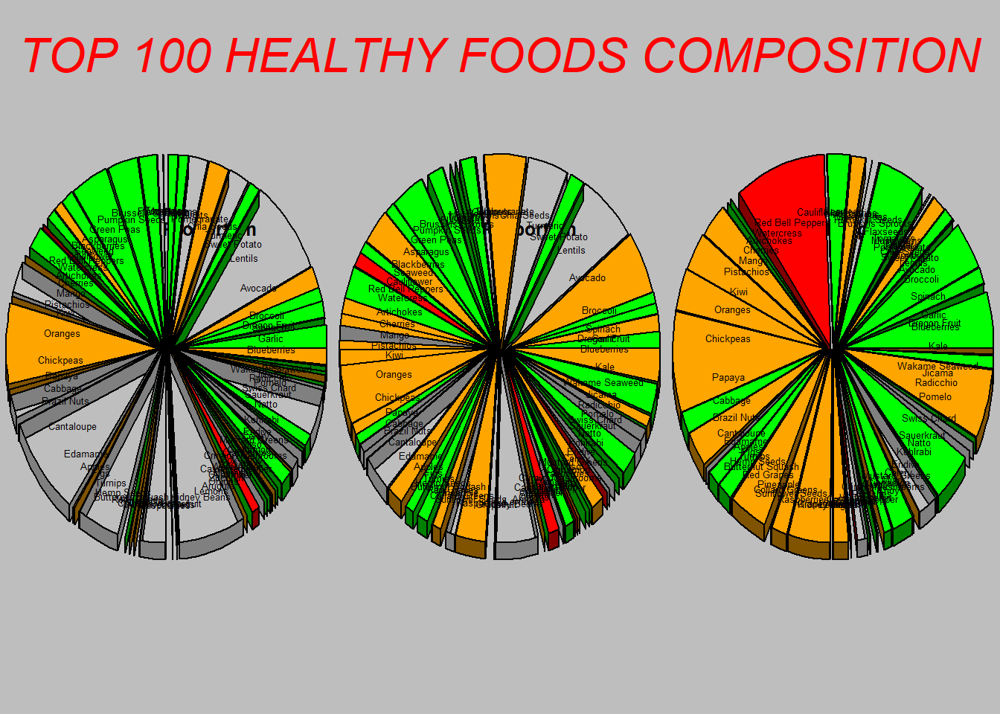
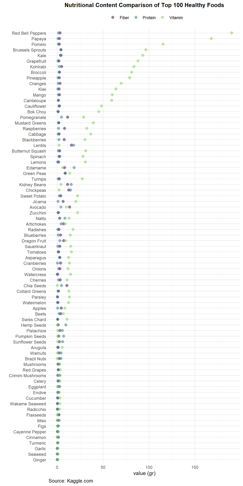

Good Plot, Bad Plot
================
Retno K. Ningrum
2024-10-29

### Load all the libraries

``` r
library(here)
library(plotrix)
library(rgl)
library(dplyr)
library(tidyverse)
library(viridis)
```

### Read the data

``` r
df <- read_csv(here('week9', 'week9_homework', 'data', 'Top100HealthiestFood.csv'))
glimpse(df)
```

    ## Rows: 98
    ## Columns: 10
    ## $ Food            <chr> "Kale", "Blueberries", "Salmon", "Garlic", "Spinach", …
    ## $ Type            <chr> "Vegetables", "Fruits", "Fish", "Spices", "Vegetables"…
    ## $ Nutrition       <chr> "High in Vitamins A, C, K", "High in Antioxidants", "R…
    ## $ Quantity        <chr> "1 cup, chopped", "1 cup", "3 oz", "1 clove", "1 cup, …
    ## $ Originated_From <chr> "Ancient Greece", "North America", "North Pacific Ocea…
    ## $ Calories        <dbl> 49, 84, 208, 4, 23, 164, 31, 320, 222, 230, 103, 2, 9,…
    ## $ Protein         <dbl> 4.3, 1.1, 22.1, 0.2, 2.9, 6.0, 2.5, 4.0, 8.1, 17.9, 2.…
    ## $ Fiber           <dbl> 3.6, 3.6, 0.0, 0.1, 2.2, 3.5, 2.4, 13.5, 5.2, 15.6, 3.…
    ## $ Vitamin         <dbl> 93.4, 14.4, 0.0, 0.9, 28.1, 0.0, 81.2, 10.0, 0.0, 2.1,…
    ## $ Antioxidant     <dbl> 1770, 9621, 689, 5708, 1515, 4454, 1510, 1922, 1808, 7…

``` r
view(df)
```

### Prepare the data

``` r
df <- df %>%
  # Adding new columns of proportion for the pie chart
  mutate(
    Protein_Prop = (Protein / sum(Protein, na.rm = TRUE)) * 100, 
    Fiber_Prop = (Fiber / sum(Fiber, na.rm = TRUE)) * 100,
    Vitamin_Prop = (Vitamin / sum(Vitamin, na.rm = TRUE)) * 100
  ) %>%
  # remove any NA, because the pie chart cannot deal with NAs
  filter(!is.na(Protein_Prop) & Protein_Prop > 0,
         !is.na(Fiber_Prop) & Fiber_Prop > 0,
         !is.na(Vitamin_Prop) & Vitamin_Prop > 0)

# Review the data
glimpse(df) 
```

    ## Rows: 77
    ## Columns: 13
    ## $ Food            <chr> "Kale", "Blueberries", "Garlic", "Spinach", "Broccoli"…
    ## $ Type            <chr> "Vegetables", "Fruits", "Spices", "Vegetables", "Veget…
    ## $ Nutrition       <chr> "High in Vitamins A, C, K", "High in Antioxidants", "C…
    ## $ Quantity        <chr> "1 cup, chopped", "1 cup", "1 clove", "1 cup, raw", "1…
    ## $ Originated_From <chr> "Ancient Greece", "North America", "Central Asia", "An…
    ## $ Calories        <dbl> 49, 84, 4, 23, 31, 320, 230, 103, 9, 138, 234, 185, 4,…
    ## $ Protein         <dbl> 4.3, 1.1, 0.2, 2.9, 2.5, 4.0, 17.9, 2.3, 0.3, 4.7, 4.7…
    ## $ Fiber           <dbl> 3.6, 3.6, 0.1, 2.2, 2.4, 13.5, 15.6, 3.8, 0.7, 10.6, 1…
    ## $ Vitamin         <dbl> 93.4, 14.4, 0.9, 28.1, 81.2, 10.0, 2.1, 22.3, 0.5, 0.1…
    ## $ Antioxidant     <dbl> 1770, 9621, 5708, 1515, 1510, 1922, 7282, 14187, 12706…
    ## $ Protein_Prop    <dbl> 1.00608329, 0.25737015, 0.04679457, 0.67852129, 0.5849…
    ## $ Fiber_Prop      <dbl> 1.21212121, 1.21212121, 0.03367003, 0.74074074, 0.8080…
    ## $ Vitamin_Prop    <dbl> 4.650468034, 0.716988648, 0.044811790, 1.399123681, 4.…

``` r
# create a dataset of type color. The purpose is to assign the color of "Type" 
type_colors <- c("Vegetables" = "green", 
                 "Fruits" = "orange", 
                 "Fish" = "blue", 
                 "Spices" = "red", 
                 "Nuts" = "purple", 
                 "Grains" = "brown")

# Assign colors based on Type, using dataset I made before
colors <- type_colors[df$Type]
```

### Creating Bad Plot

``` r
#create a function for a bad plot
bad_pie_chart <- function(data, values, title, labels, color) {     
 
   # 3D Pie chart with default colors and small labels
  pie3D(values,               #assign the value as the data we want to use 
        col = color,          #color by the value color
        labels = labels,      #assign the labels as the label we want to use
        labelcex = 0.4,       #set the size of the label
        explode = 0.1,        #set the distance (explode) between slices
        main = title,         #assign the title as the title data we want to use
        radius = 1.8,         #set the distance between pie chart / radius
        theta = 2,            #set the angle of the 3D pie chart
        shade = 0.5)          #set the shading color of 3D pie chart
}

# Ploting all 3 pie charts in one frame
par(mfrow = c(1, 3),  #create 1 row, 3 column
    bg = "grey")     #use grey as the background
   
# Assign 3 Pie charts for Protein, Fiber, and Vitamin
bad_pie_chart(df, df$Protein_Prop, "PROTEIN Proportion", df$Food, colors)
bad_pie_chart(df, df$Fiber_Prop, "FIBER Proportion", df$Food, colors)
bad_pie_chart(df, df$Vitamin_Prop, "VITAMIN Proportion", df$Food, colors)

# Add large title with red color
mtext("TOP 100 HEALTHY FOODS COMPOSITION",     #the title
      side = 3,                                #place the title on top
      line = -4,                               #set the margin line
      outer = TRUE,                            #use outer margin line
      cex = 2,                                 #Character expansion / size title
      font = 3,                                #Set the font type
      col = "red")                             #adjust the title font color
```


Why this plot is a **BAD PLOT** ?

1.  It use 3D Style  
    The use of a 3D style is ineffective for data visualization because
    the 3D effect distorts data representation. It makes it challenging
    for viewers to accurately interpret the size and proportion of each
    segment.

2.  It use pie chart for lots of categories  
    Pie charts are generally not recommended for visualizing data,
    especially with numerous categories. As the number of categories
    increases, the slices become smaller, making it difficult to discern
    individual values—even with labels. This cluttered format
    significantly reduces the plot’s readability and effectiveness.

3.  Label in each slice  
    With many small slices, the labels overlap and become nearly
    unreadable. This results in a poor interpretation of the data, as
    viewers are unable to easily identify each slice or category.

4.  No legend of the colors  
    The slices are color-coded to represent different food types, but
    without a legend, viewers cannot identify what each color
    represents. This oversight leaves the color coding meaningless,
    undermining the plot’s purpose.

5.  Missleading Color Choice  
    The use of a bold red color for one slice draws unnecessary
    attention, implying importance where there is none. Highlighting one
    slice without any contextual reason can lead to incorrect
    assumptions and misinterpretations.

6.  Title Formating  
    The title’s large size and bright red color overshadow the data in
    the chart itself. Aesthetically, the color clashes with the
    background and distracts from the content. The title should be
    balanced with the plot so that the data remains the focal point.

7.  Poor Background Choice  
    The grey background is a poor choice, as it closely matches the
    color of some slices, causing them to blend into the background.
    This lack of contrast reduces the visibility of certain segments,
    diminishing the plot’s overall clarity.

### Creating Good Plot

``` r
#First I want to reshape the dataset into long format, because I want to arrange the positions based on the best food to less-best food. Thus, I need one column that contain all value from 3 categories (fiber, protein, and vitamin)
df_long <- df %>%                                  #create new dataset named "df_long
  select(Food, Type, Fiber, Protein, Vitamin) %>%  #select only these column
  pivot_longer(                               #pivot longer with these condition:
    cols = c(Fiber, Protein, Vitamin),        #combine all the fiber, protein, and vitamin into new column
    names_to = "Nutrient",                    #name the new column into "Nutrient"     
    values_to = "Value")                      #put the value into new column "value"
  
#Create the plot
ggplot(df_long,                                     #use ggplot to create the plot, with df_long dataset
       aes(x = Value,                               #assign the x-axis with "Value"
           y = reorder(Food,                        #assign the y-axis with "Food", then
                       Value,                       #reorder by the "Value"
                       FUN = mean))) +              #based on the mean of "Value"
  geom_point(aes(color = Nutrient),     #add geom point with color based on the "Type" category
             size = 2.5,                #set the size of point
             alpha = 0.5) +             #set the transparency due to overlapping possibility
  scale_color_viridis(      #use the colorblind friendly choice of color
    discrete = TRUE,        #create distinct separate color
    option = "D",           #use the option D "viridis"
    end = 0.8,              #set the corrected hue, at which the color map ends
    name = ""               #not using any label to avoid redundancy
  ) +
  labs(
    x = "value (gr)",     #add the x-axis label to shows the value content 
    y = "",               #not adding any y-axis label, as it is obvious (limit redundancy)
    title =  "Nutritional Content Comparison of Top 100 Healthy Foods", #add title
    caption =  "Source: Kaggle.com") + #add sources
  theme_minimal() +       #use this theme
  theme(
    plot.title =  element_text(hjust = 0.5, size = 12, face = "bold"),#set the tittle position, size, bold
    plot.caption =  element_text(hjust =  0, size = 10),    #set the caption position and size
    legend.position = "top",                              #set legend on the right
    panel.grid.major = element_line(color = "gray90"),      #add panel grid major with gray90 color
    panel.grid.minor = element_line(color = "gray95"),      #add panel grid minor with gray95 color
    axis.text.y = element_text(size = 9))                   #adjust the x-axis text size
```


Why is it a **Good Plot** ?

1.  Align to the creator goal  
    The goal of this plot is to present a detailed comparison of the top
    100 healthy foods by their fiber, vitamin, and protein content. By
    placing the food items on the y-axis, viewers can easily scan
    through all the categories and identify the nutritional content of
    each item.

2.  Choice of color  
    The plot uses colors from the viridis color palette, which is
    colorblind-friendly, making it accessible to a wider audience. Each
    nutrient—fiber, vitamin, and protein—is represented by a distinct
    color, clearly indicating that these categories are independent of
    each other. The semi-transparent colors allow for visibility of
    overlapping points, which helps highlight variations in nutrient
    levels.

3.  Legend Placement The legend is positioned at the top, keeping it
    accessible and uncluttered. The simplicity of having no title for
    the legend reduces visual noise, as the plot title and colors
    already make it clear what each color represents. Placing the legend
    at the top also helps balance the composition, preventing excess
    empty space on the right side of the plot.

4.  Source  
    Providing the data source (“Kaggle.com”) adds credibility and
    transparency, showing that the data is traceable and reliable. A
    clear source is essential for any informative graphic to allow
    viewers to verify and trust the data.

5.  x-axis, y-axis label  
    In this plot, only the x-axis has a label, as it’s essential for
    indicating the units (grams) of nutritional content. The y-axis
    label is omitted, which helps reduce redundancy since the food names
    are clearly listed, and the title already conveys that foods are
    being compared. This keeps the chart clean and focused.  

6.  Title  
    The title is bold and well-proportioned, making it easy to read and
    understand at a glance. It’s straightforward and emphasizes that
    this chart is a comparison of nutritional content, giving context to
    the entire visualization.
